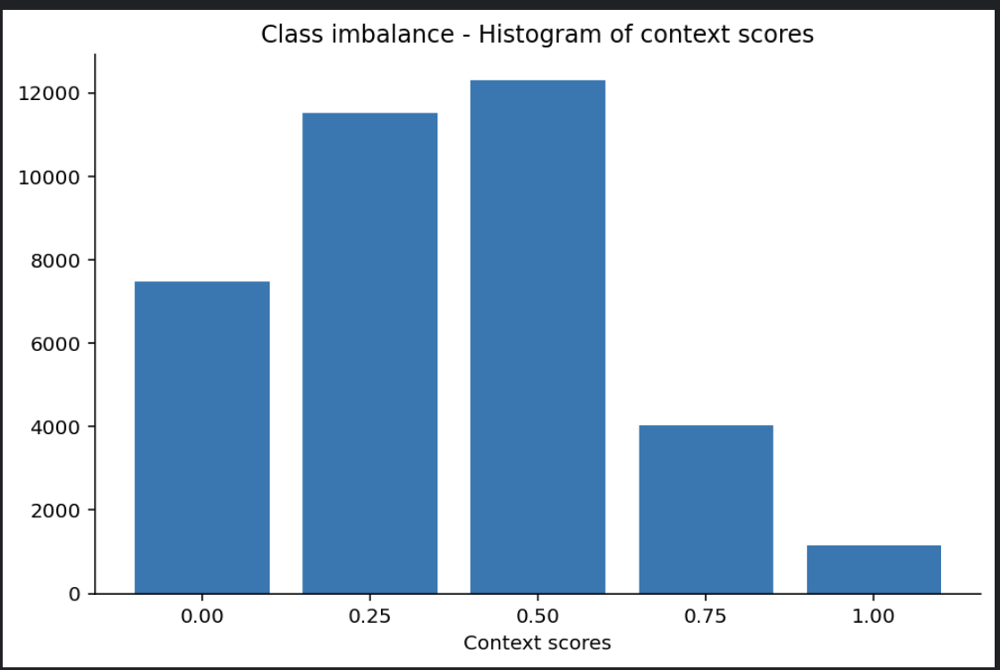

# msds631-finalproject

## MSDS 631 - Final Project

### Project description

The patent review process involves searching for past filed patents in the same domain of a new patent application. The search keywords used by legal analysts depend on context of the patent application. For example, "strong material" could mean "steel" for construction purposes or "denim" for textiles. This Kaggle competition aims to find a relevance score (five levels from 0 to 1) of a target keyword with a given ancho r word in the context of a domain

### Training data description

### Preprocessing steps

### NLP model selection

### Results
